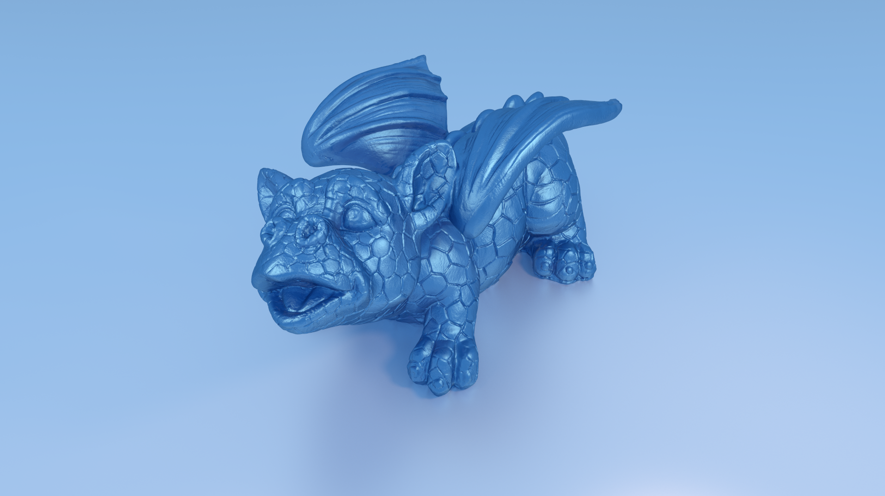

# jumboRT
A lightweight, portable, fast and powerful pathtracer
fully written in C, capable of running on CPU, GPU and on distributed systems

## Features
- Unidirectional path tracer
- Kd-tree for acceleration
- Texture mapping (Albedo, Normal, Height, Emission, Refractiveness, Metallicness....)
- Theoretical lights (Point, Directional, Cone)....
- Multiple importance sampling
- Tile texturing
- Multiple BSDFs
- Volumetric lightning
- OpenCL implementation (for GPU, FPGA's, etc...)
- Multithreading support
- Distributed rendering over network
- Custom made deflate compression for network rendering
- Lossy network compression
- HDR support
- Texture filtering
- Light refraction
- and more...
